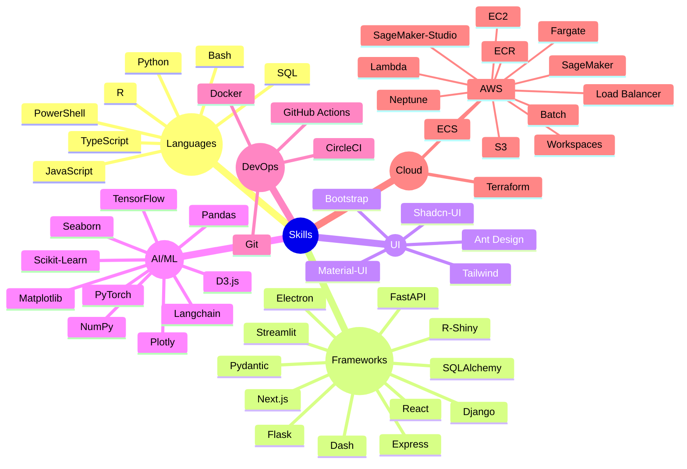

# 👋 Hi, I'm Pratik Kumar  
### 💻 Full Stack Engineer | AI/ML Enthusiast | Writer  

🚀 Software Engineer 2 at **Elucidata** | Building scalable platforms at the intersection of **data, AI/ML, and infra**. Passionate about developer experience, product thinking, and intelligent systems.

Alternate id - [@pkelucidata](https://github.com/pkelucidata)

### ⚡ Tech Snapshot

### ✍️ Writing & Blogs  
📚 Featured on: [Substack](https://pratikkumar.substack.com) · [GitHub Blog](https://pr2tik1.github.io) · [Towards AI](https://towardsai.net/author/pratik-kumar)

### 🤝 Connect with Me  
[🌐 Portfolio](https://pratik-kumar.netlify.app) · [💼 LinkedIn](https://linkedin.com/in/pratik-kumar04) · [🧑‍💻 GitHub](https://github.com/pr2tik1) · [📝 Substack](https://pratikkumar.substack.com) · 📧 **pr2tik1@gmail.com**

Thanks for visiting! ✨ Let's build something awesome together.

  
  

